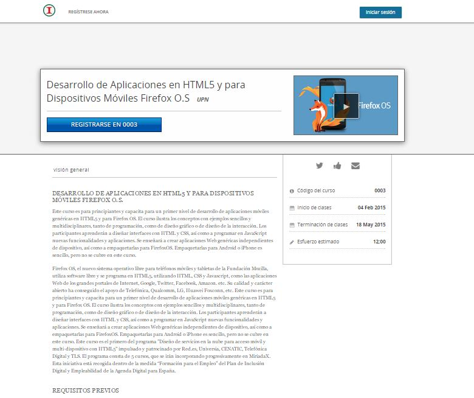

# Ver oferta de programas

Cualquier persona, tanto externa como interna de las dependencias de gobienro, pueden ver la oferta de programas que se encuentran en la plataforma.

Para poder ver dichos programas, únicamente debe entrar al sitio web y estos aparecerán al inicio en la parte inferior.

Para ver más detalles del curso, haga click sobre la imagen y aparecerá automáticamente la información.

Podrá ver una descripción detada, un video introductorio, fecha de inicio, fecha de término, horas dedicadas a la semana, instructores y preguntas frecuentes. 

Para poder registrarse, tiene que iniciar sesión como usuario, es decir, ser funcionario público.

