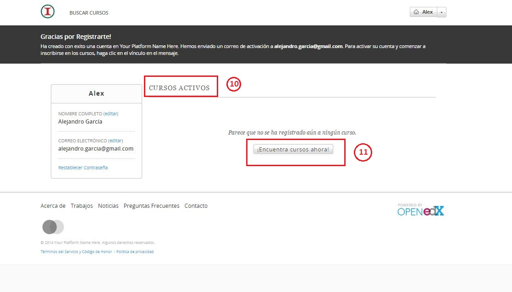
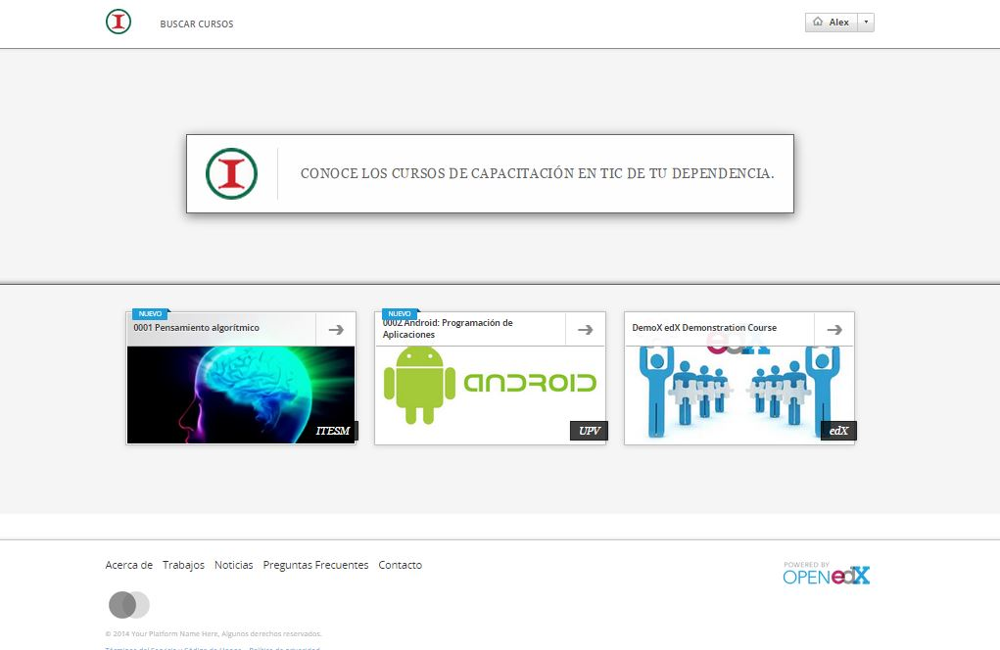

# Iniciar sesión y nuevos usuarios

INICIAR SESIÓN

Para iniciar sesión como usuario previamente registrado:

1. Haga click en el botón "Iniciar sesión", en la parte superior derecha, posriormente tendrá acceso a la información de su perfil.

REGÍSTRARSE COMO NUEVO USUARIO

Si nunca ha iniciado sesión, debe registrarse como un nuevo usuario.

1. Haga click en la parte superior izquierda en el botón "Registrarse ahora".
2. También pude dar click en "Iniciar sesión" y seleccionar la opción "¿No está inscrito?".

3. Ingrese su correo electrónico.
4. Escriba su nombre completo.
5. Escriba un nombre de usuario.
6. Escriba una contraseña.
7. Indique su grado de estudios, su géner y año de nacimiento.
8. Escriba su dirección actual.
9. Indique las razones que lo llevaron a inscribirse (opcional).
Se enviará  un correo electrónico para verificar que efectivamente dicho correo pertenezca a usted. 

NOTA: Falta agregar más datos del perfil,  de la formación académica, trayectoria laboral y  cursos deseados. Se incluirán en el desarrollo del proyecto.

 
SELECCIONAR TEMAS DE INTERÉS

Se incluirá en el desarrollo del proyecto. 

SELECCIONAR CURSOS DE INTERÉS
Una vez que se hay registrado como nuevo usuario aparecerán las siguientes  opciones:

10. Cursos activos
11. Seleccionar cursos de interés

Al hacer click sobre algún curso en específico aparecerá la información más detallada de dicho curso.

*Descripción
*Horas
*Estructura del curso
*Instructor
*Preguntas frecuentes

