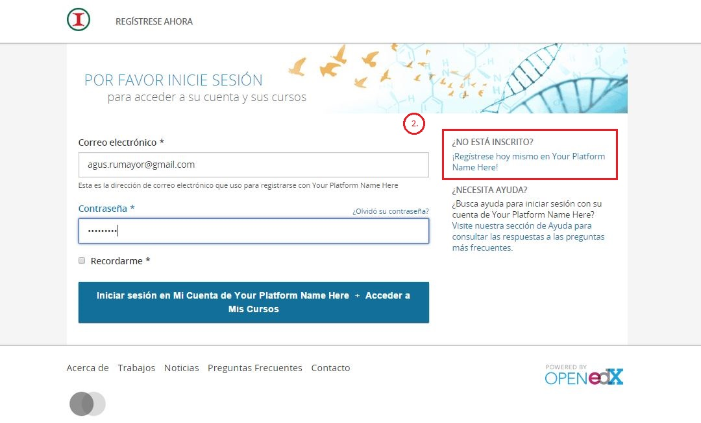

# Iniciar sesión y nuevos usuarios

INICIAR SESIÓN

Para iniciar sesión como usuario previamente registrado:

1. Haga click en el botón "Iniciar sesión", en la parte superior derecha, posriormente tendrá acceso a la información de su perfil.

Si nunca ha iniciado sesión, debe registrarse como un nuevo usuario.

1. Haga click en la parte superior izquierda en el botón "Registrarse ahora".
2. También pude dar click en "Iniciar sesión" y seleccionar la opción "¿No está inscrito?".

