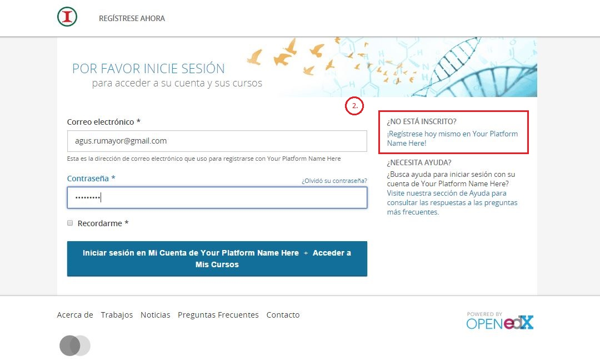
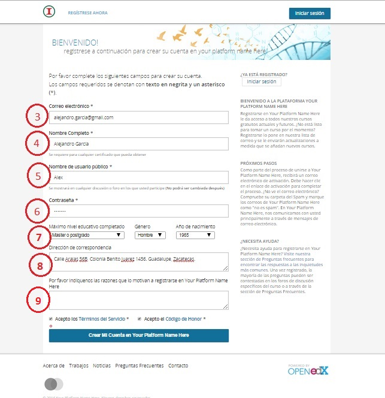

# Subir información de perfil 

Si nunca ha iniciado sesión, debe registrarse como un nuevo usuario.

1. Haga click en la parte superior izquierda en el botón "Registrarse ahora".
2. También pude dar click en "Iniciar sesión" y seleccionar la opción "¿No está inscrito?".

3. Ingrese su correo electrónico.
4. Escriba su nombre completo.
5. Escriba un nombre de usuario.
6. Escriba una contraseña.
7. Indique su grado de estudios, su género y año de nacimiento.
8. Escriba su dirección actual.
9. Indique las razones que lo llevaron a inscribirse en la plataforma (opcional).

Posteriormente, se enviará  un correo electrónico para verificar que efectivamente dicho correo pertenezca a usted. 

NOTA: Falta agregar más datos del perfil, como la formación académica, trayectoria laboral y  cursos deseados. Estos datos se incluirán en el desarrollo del proyecto.

 
