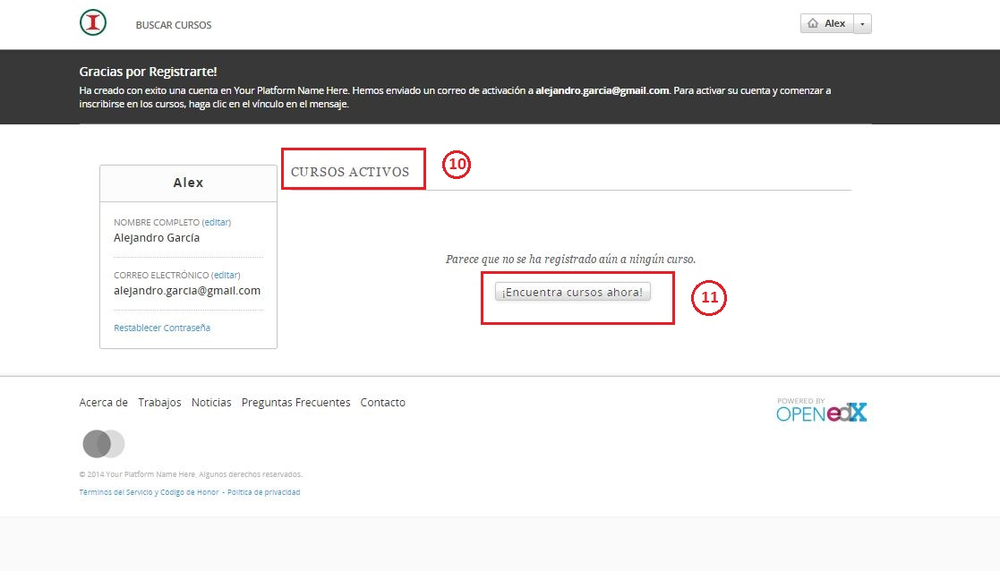

# Seleccionar temas de interés

La sección de temás de interés no se agregó en el prototipo. Pero aparecerá a continuación, después de iniciar sesión dentro de la información del perfil. 

SELECCIONAR CURSOS DE INTERÉS

Una vez que se hay registrado como nuevo usuario aparecerán las siguientes  opciones:

10. Cursos activos
11. Seleccionar cursos de interés

Al hacer click sobre algún curso en específico aparecerá la información más detallada de dicho curso. 

* Descripción
* Horas
* Estructura del curso
* Instructor
* Preguntas frecuentes

Para inscribirse en el curso, haga click sobre el botón "Registrarse en XXXX".

