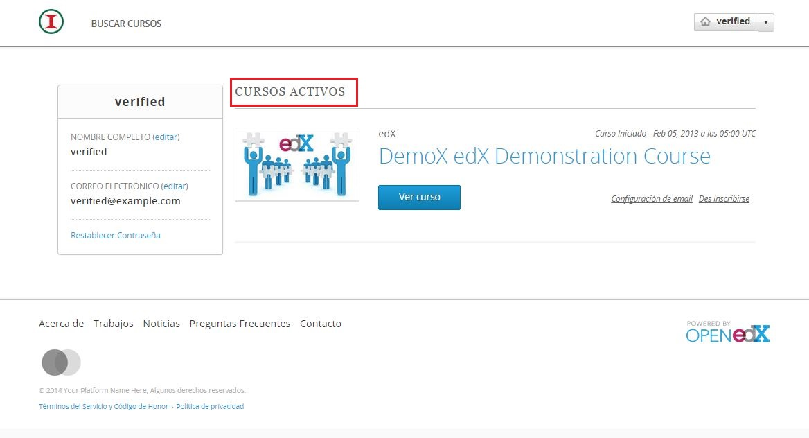

# Ver cursos tomados

Para visualizar los cursos que se están tomando actualmente y los que se han tomado antes, se debe iniciar sesión y en seguida aparecerán dichos cursos:

En esa sección de la información del perfil aparecerán los cursos que se están tomando y los que se han tomado previamente. 

NOTA: En el desarollo del proyecto se agregará la sección de "Insignias", las cuales  acreditarán el cumplimiento con los cursos tomados. 