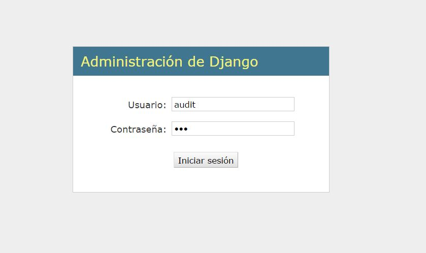
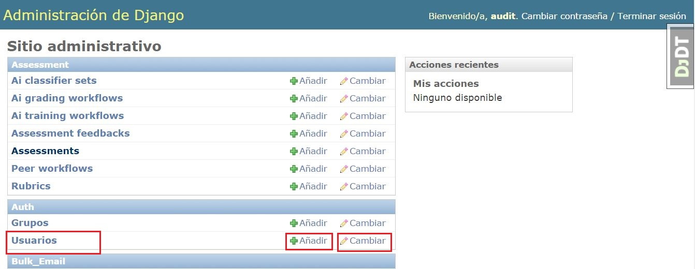
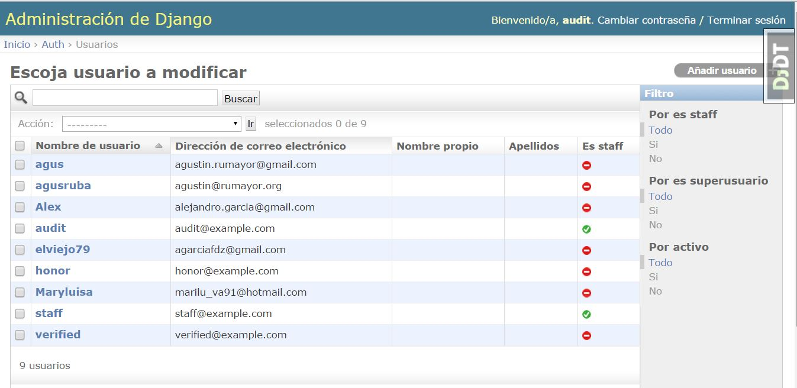

# Ver información de usuarios y sus cursos

Como administrador podrá ver la información del perfil de los diferentes usuarios, así como administrarlos.

Primero escriba sus datos para iniciar sesión, nombre de usuario y contraseña.

Después vaya a la sección "Usuarios", aquí podrá añadir o cambiar usuarios. Haga click sobre este botón para ver todos los usarios registrados. 

Posteriormente aparecerá una pantalla con la siguiente. Donde podrá cambiar usuarios, aliminarlos, filtrar o buscarlos.
 

Nota: Esta funcionaliad aún no está terminada. Cuando se desarrolle el proyecto, el administrador de la aplicación podrá ver información de actividad y cursos de todos los usuarios, sin necesidad de pertenecer a una dependencia en específico. 