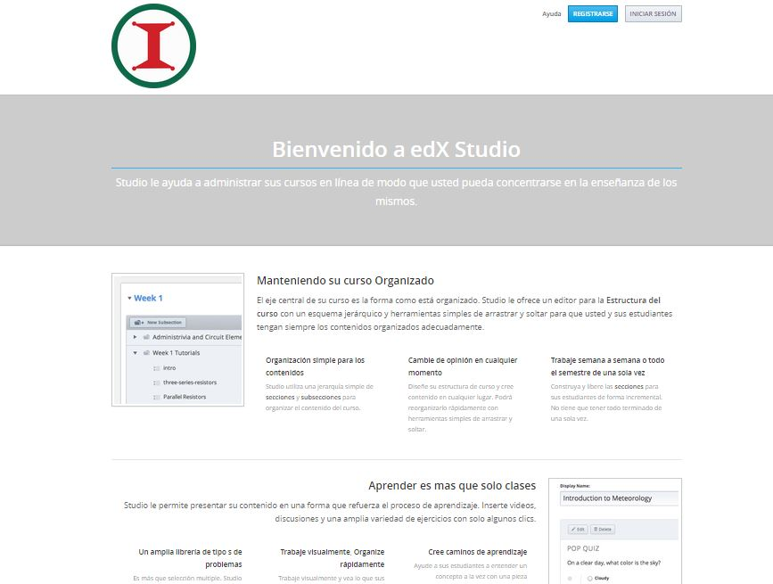
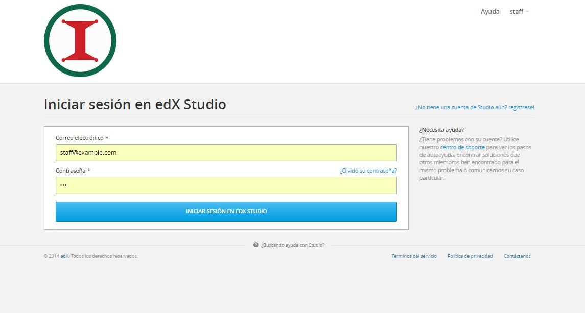
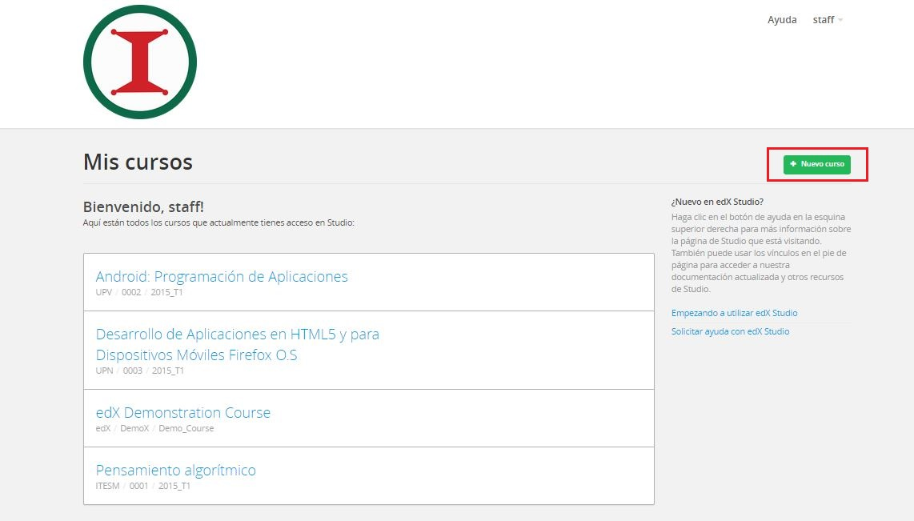

# Conectar a la plataforma y dar de alta cursos
INICIAR SESIÓN O REGISTRO DE NUEVO USUARIO

Para accesar como socio tecnológico o empersa de TIC. Primero se debe iniciar sesión, o bien, darse de alta como nuevo usuario.

Escriba su correo electrónico y contraseña para iniciar sesión.

DAR DE ALTA CURSOS

Una vez que haya iniciado sesión,aparecerá la siguiente patalla. De click en el boton "Nuevo curso".

Llene la información necesaria para crear el perfil del nuevo curso. Escriba el nombre del curso, la organización, el código (folio) del curso, y el periodo. Estos datos no podrán ser modificados después.

 

Posteriormente, llene la estructura, descripción y horarios del curso.
